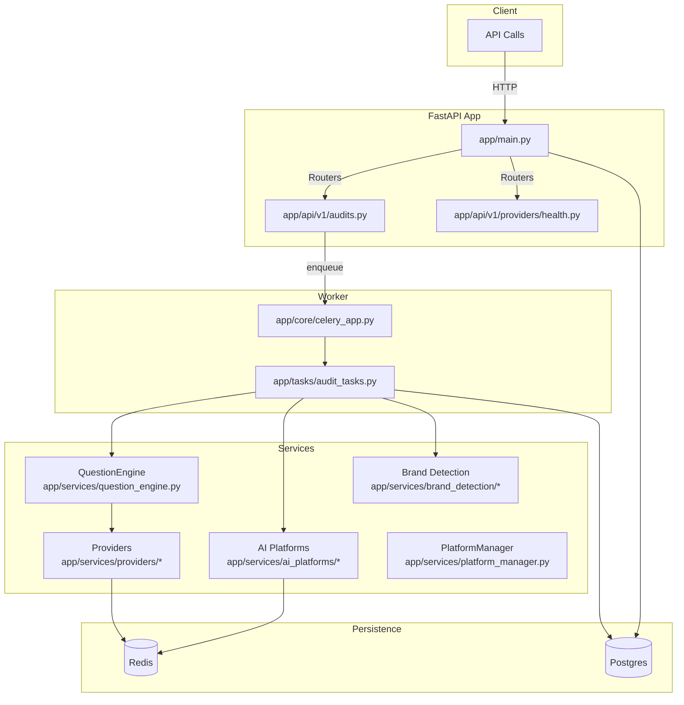
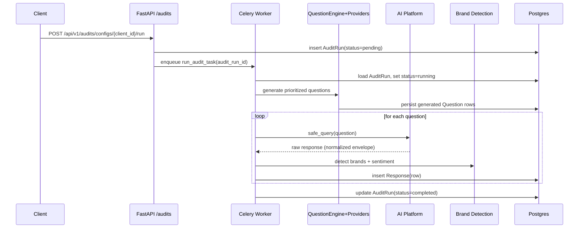

## AEO Competitive Intelligence Tool — Architecture Overview

### Purpose
This document explains how the current codebase is structured, how modules depend on and interact with each other, and the end‑to‑end execution flow. It is intended to be sufficient for an engineer or an LLM to navigate, extend, or integrate with the system.

### High‑level System

### Runtime Components
- **FastAPI application**: `app/main.py`
  - Mounts routers: `app/api/v1/audits.py`, `app/api/v1/providers/health.py`
  - Configures CORS, Sentry (optional), Prometheus instrumentation
  - Uses structured logging via `app/utils/logger.py`

- **Celery worker**: `app/core/celery_app.py`, tasks in `app/tasks/audit_tasks.py`
  - Broker and backend: Redis
  - JSON serialization, timeouts, structured logging

- **Database**: Postgres via SQLAlchemy
  - Engine/session: `app/db/session.py`
  - Models: `app/models/*` and `app/db/base.py`

- **Cache**: Redis
  - Async cache manager: `app/utils/cache.py`

- **Observability**
  - Prometheus FastAPI instrumentation in `app/main.py`
  - Domain metrics in `app/services/metrics.py`
  - Structured logs with `structlog` via `app/utils/logger.py`
  - Optional Sentry integration (FastAPI and Celery)

### Configuration & Secrets
- Central settings: `app/core/config.py` (Pydantic BaseSettings)
  - Database (POSTGRES_*), Redis, LLM/OpenAI keys, environment flags
- Platform configs: `app/core/platform_settings.py`
  - Per‑platform defaults, rate limits, env var mapping (`REQUIRED_ENV_VARS`)
- Docker compose defines Postgres, Redis, worker, web; environment should be passed via `.env` as per repo docs.

## Modules and Their Responsibilities

### API layer
- `app/api/v1/audits.py`
  - `POST /api/v1/audits/configs/{client_id}/run`: creates an `AuditRun` and enqueues the Celery task `run_audit_task`.
  - `GET /api/v1/audits/runs/{run_id}/status`: returns `AuditRun` status.
- `app/api/v1/providers/health.py`
  - `GET /api/v1/providers/health`: invokes `QuestionEngine` provider health checks and aggregates results.

Dependencies:
- Uses `app/db/session.py` to get DB session.
- Reads/writes `app/models/audit.py` entities.
- Enqueues Celery task from `app/tasks/audit_tasks.py`.

### Tasks / Orchestration
- `app/core/celery_app.py`: Celery app initialization, logging, Sentry, worker tuning.
- `app/tasks/audit_tasks.py`: Core orchestration for an audit run.
  - Loads `AuditRun` from DB, sets status to running.
  - Initializes Brand Detection (`app/services/brand_detection/*`).
  - Initializes `QuestionEngine`, generates prioritized questions via providers.
  - Persists generated questions to `app/models/question.py`.
  - For each question: queries AI Platform (OpenAI, etc.), extracts text, runs brand detection, persists `Response`, marks run completed.

Notes on current platform usage:
- The repo contains a robust multi‑platform client layer (`app/services/ai_platforms/*`) and `PlatformManager`, but `audit_tasks.py` currently constructs `OpenAIPlatform` directly. The intended pattern is to use `PlatformManager` (which consults `platform_settings` and `PlatformRegistry`) so tasks can fan out across multiple platforms without changing task code.

### Question generation
- `app/services/question_engine.py`
  - Orchestrates multiple providers concurrently (`TemplateProvider`, `DynamicProvider`).
  - Consolidates and prioritizes questions with deterministic de‑duplication.
  - Emits Prometheus metrics around provider latency/failures.

- Providers: `app/services/providers/*`
  - `TemplateProvider`: deterministic templates and industry patterns.
  - `DynamicProvider`: LLM‑driven generation pipeline with caching and retries.
    - `TrendsAdapter` (mock seeds), `PromptBuilder`, `LLMClient` (OpenAI async), `PostProcessor` (cleanup/dedupe/limit), `CacheManager` (Redis).

### AI Platform clients
- `app/services/ai_platforms/base.py`
  - `AIRateLimiter`: token‑bucket with bursts.
  - `BasePlatform`: async session lifecycle, standardized `safe_query` with retries, rate‑limit handling, circuit breaker, error taxonomy.
- Implementations: `openai_client.py`, `anthropic_client.py`, `perplexity_client.py`, `google_ai_client.py`.
- `registry.py`: name→class factory, dynamic registration.
- `platform_manager.py`: loads configured platforms using `PLATFORM_CONFIGS` and available API keys; exposes `get_platform`, `health_check`, and metadata.

Standard interaction pattern during audits:
1) Platform acquired from `PlatformManager` (or constructed if running single‑provider).
2) `async with platform` to create an HTTP session.
3) `await platform.safe_query(question)` to get a normalized response envelope.
4) `platform.extract_text_response(...)` to get clean text for downstream analysis.

### Brand detection engine
- Package: `app/services/brand_detection/*`
  - `core/detector.py`: `BrandDetectionEngine` and `BrandDetectionOrchestrator` combining fuzzy matching and semantic similarity with market adapters, optional caching, and hybrid sentiment.
  - `core/normalizer.py`, `core/similarity.py`, `core/sentiment.py`: text normalization, similarity (with batch hybrid), and sentiment (VADER + business‑context hybrid).
  - `market_adapters/*`: market‑specific rules (e.g. German).
  - `models/brand_mention.py`: typed mention and result models.
  - `utils/cache_manager.py`, `utils/performance.py`: engine‑local caching and performance decorators.

### Data model (simplified)
- `app/models/audit.py`
  - `Client`: `id`, `name`, `industry`, `product_type`, `competitors` (JSON)
  - `AuditRun`: `id`, `client_id`, `config` (JSON), `status`, `error_log`; rels: `client`, `responses`, `report`
- `app/models/question.py`
  - `Question`: `id`, `question_text`, `category`, `provider`, cost/tokens/metadata (JSON)
- `app/models/response.py`
  - `Response`: `id`, `audit_run_id`, `question_id`, `response` (text), `raw_response` (JSON), `platform`, `brand_mentions` (JSON)
- `app/models/report.py`
  - `Report`: `id`, `audit_run_id`, `file_path`

DB setup and imports are centralized in `app/db/base.py` and `app/db/session.py`.

## End‑to‑End Flows

### Triggering an audit run

### Provider health
- `GET /api/v1/providers/health` gathers `provider.health_check()` concurrently; returns 503 if any fail.

## Observability and Resilience
- Logging: `app/utils/logger.py` configures `structlog` for both API and worker; use `get_logger(__name__)` and bind contexts (`add_audit_context`, `add_platform_context`).
- Metrics: `app/services/metrics.py` exports Prometheus counters/histograms for provider calls, cache hits, LLM calls/failures/cost.
- Circuit breaker & retries: Implemented in `BasePlatform.safe_query` with error taxonomy (`exceptions.py`).
- Rate limiting: Platform‑side via `AIRateLimiter`. API rate limiting is stubbed in `app/utils/rate_limiter.py` and can be added as FastAPI middleware.

## Security & Config
- Secrets are pulled from environment via `app/core/config.py`. Do not commit keys; use `.env` locally and CI/Vault in production.
- CORS is currently permissive (`*`) in `app/main.py`; restrict in production.

## Current Gaps vs Intended Design
- `audit_tasks.py` constructs `OpenAIPlatform` directly; the intended approach is to use `PlatformManager` with `PLATFORM_CONFIGS` and `PlatformRegistry` to enable multi‑provider audits and centralized config/rate limits.
- Centralized API error handling is stubbed in `app/utils/error_handler.py`.
- API rate limiting is stubbed in `app/utils/rate_limiter.py`.
- Report generation service is not yet wired, though `Report` model exists.

## Roadmap (near‑term, incremental)
- Platform integration
  - Replace direct platform instantiation in `app/tasks/audit_tasks.py` with `PlatformManager`.
  - Allow per‑audit `config["platforms"]` to fan‑out across multiple platforms simultaneously.
- Error handling & rate limiting
  - Implement exception mappers and error responses in `app/utils/error_handler.py` and integrate in FastAPI.
  - Add API rate limiting middleware using Redis token buckets (`app/utils/rate_limiter.py`).
- Reporting
  - Implement a `ReportGenerator` service and Celery task to produce PDFs stored under `reports/` and linked from `Report` rows.
- Health & monitoring
  - Expose platform health via API using `PlatformManager.health_check()`.
  - Add Grafana dashboards for: API latency/error rates, Celery task durations/failures, LLM call volume/cost, cache hit rate.
- Data model hardening
  - Align SQLAlchemy table names and FKs across models and Alembic migrations; enforce constraints, add indices for common queries.
- Security
  - Tighten CORS; enforce authn/authz gates on audit endpoints; protect task endpoints.

## File Map (where to look when extending)
- API: `app/main.py`, `app/api/v1/audits.py`, `app/api/v1/providers/health.py`
- Tasks: `app/core/celery_app.py`, `app/tasks/audit_tasks.py`
- Question generation: `app/services/question_engine.py`, `app/services/providers/*`
- AI Platforms: `app/services/ai_platforms/*`, `app/services/platform_manager.py`, `app/core/platform_settings.py`
- Brand detection: `app/services/brand_detection/*`
- Persistence: `app/models/*`, `app/db/*`
- Observability: `app/services/metrics.py`, `app/utils/logger.py`
- Infra: `docker-compose.yml`, `Dockerfile`, monitoring configs in `monitoring/`

This overview reflects the state of the code in this repository and highlights the intended direction to reach a fully multi‑provider, observable, and resilient audit pipeline.
