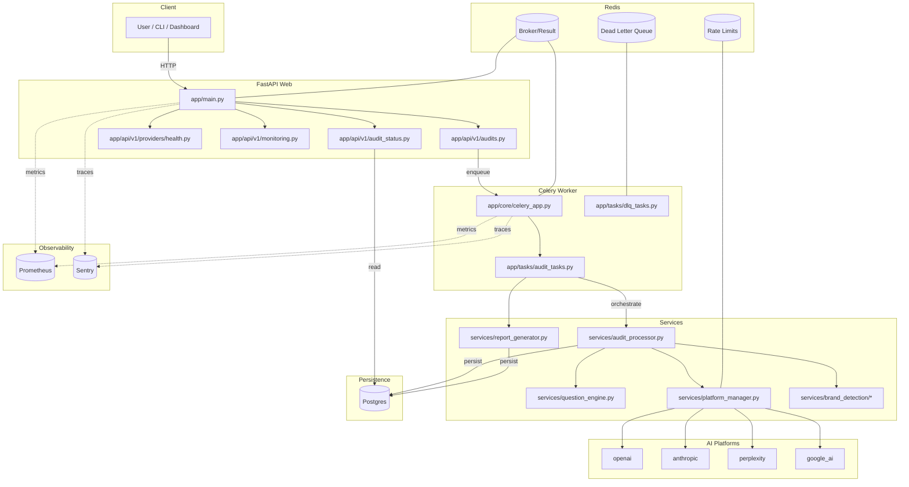

# AEO Audit Tool - Architecture Plan

## Overview

The AEO (Answer Engine Optimization) Audit Tool is a comprehensive competitive intelligence platform that simulates user questions across multiple AI platforms to analyze brand visibility and competitive positioning. The system orchestrates complex workflows involving question generation, multi-platform AI querying, brand detection, sentiment analysis, and detailed reporting.

## System Architecture

### High-Level Architecture

```
┌─────────────────┐    ┌─────────────────┐    ┌─────────────────┐
│   Client/API    │────│  FastAPI Web    │────│   PostgreSQL    │
│   Requests      │    │   Application   │    │    Database     │
└─────────────────┘    └─────────────────┘    └─────────────────┘
                              │
                              │
                       ┌─────────────────┐    ┌─────────────────┐
                       │  Celery Worker  │────│   Redis Cache   │
                       │   (Background   │    │  & Message      │
                       │   Processing)   │    │    Broker       │
                       └─────────────────┘    └─────────────────┘
                              │
                    ┌─────────────────────────┐
                    │    AI Platforms         │
                    │  (OpenAI, Anthropic,    │
                    │  Perplexity, Google)    │
                    └─────────────────────────┘
```

### Mermaid Diagram



## Core Components

### 1. Web Application Layer (`app/main.py`)

**Purpose**: FastAPI-based REST API serving as the primary interface for audit operations.

**Key Features**:
- CORS middleware for cross-origin requests
- Security headers and access logging
- Prometheus metrics instrumentation
- Sentry integration for error monitoring
- OpenTelemetry distributed tracing

**Dependencies**:
- PostgreSQL database via SQLAlchemy ORM
- Redis for caching and session management
- Celery for asynchronous task processing

### 2. Database Layer

**Primary Database**: PostgreSQL
- **Clients**: Brand/client information and competitors
- **AuditRuns**: Audit execution metadata and progress tracking
- **Questions**: Generated questions for AI platform testing
- **Responses**: AI platform responses with metadata
- **Reports**: Generated PDF reports and metadata

**Cache Layer**: Redis
- Session management
- Rate limiting counters
- Temporary data storage for async operations
- Celery message broker

### 3. Audit Orchestration System

#### 3.1 Audit Processor (`app/services/audit_processor.py`)

**Core Responsibility**: Main orchestrator for complete audit workflows

**Process Flow**:
1. **Initialization**: Load audit configuration and validate client data
2. **Question Generation**: Generate strategic questions using QuestionEngine
3. **Platform Coordination**: Distribute questions across available AI platforms
4. **Response Processing**: Collect and process AI responses with brand detection
5. **Progress Tracking**: Real-time progress updates with batch processing metrics
6. **Finalization**: Aggregate results and update audit status

**Key Features**:
- Batched processing with configurable batch sizes
- Circuit breaker patterns for platform failures
- Comprehensive error handling and retry logic
- Brand mention detection and sentiment analysis
- Platform-specific statistics and cost tracking

#### 3.2 Platform Manager (`app/services/platform_manager.py`)

**Purpose**: Centralized management of AI platform integrations

**Capabilities**:
- Dynamic platform initialization based on API key availability
- Health checking and availability monitoring
- Platform-specific configuration management
- Unified interface for heterogeneous AI platforms

**Supported Platforms**:
- OpenAI (GPT models)
- Anthropic (Claude models)
- Perplexity (web-augmented responses)
- Google AI (Gemini models)

#### 3.3 Question Engine (`app/services/question_engine.py`)

**Function**: Intelligent generation of strategic audit questions

**Question Types**:
- Brand comparison scenarios
- Feature positioning queries
- Alternative-seeking questions
- Industry-specific inquiries
- Competitive recommendation scenarios

**Prioritization System**:
- Category-based scoring (comparison, recommendation, alternatives)
- Strategic value weighting
- Dynamic question limiting

### 4. AI Platform Integration

#### 4.1 Base Architecture (`app/services/ai_platforms/base.py`)

**Design Pattern**: Abstract base class with standardized interface

**Core Methods**:
- `safe_query()`: Rate-limited queries with retry logic
- `extract_text_response()`: Platform-specific response parsing
- Context management for session handling

#### 4.2 Platform-Specific Implementations

Each platform client inherits from `BasePlatform` and implements:
- Authentication handling
- Request formatting
- Response parsing
- Error handling and rate limiting
- Cost calculation and token tracking

**Registry Pattern**: `PlatformRegistry` provides factory methods for platform instantiation

### 5. Background Processing (Celery)

#### 5.1 Task Architecture (`app/tasks/audit_tasks.py`)

**Primary Task**: `run_audit_task`
- Comprehensive audit execution with full error handling
- Automatic retry logic with exponential backoff
- Dead Letter Queue (DLQ) integration for failed tasks
- Progress tracking and metrics collection

**Supporting Tasks**:
- `generate_report_task`: PDF report generation
- `cleanup_old_audit_runs`: Maintenance and cleanup

#### 5.2 Celery Configuration (`app/core/celery_app.py`)

**Settings**:
- JSON serialization for cross-platform compatibility
- UTC timezone standardization
- Task time limits (30-minute hard limit)
- Prefetch multiplier optimization
- Periodic DLQ processing (10-minute intervals)

### 6. Brand Detection and Sentiment Analysis

#### 6.1 Brand Detection Engine (`app/services/brand_detection/`)

**Core Capabilities**:
- Multi-language brand name normalization
- Fuzzy matching with configurable confidence thresholds
- Context window analysis for mention accuracy
- Market-specific adapters (German market support)

**Detection Pipeline**:
1. Text preprocessing and normalization
2. Brand name extraction using similarity algorithms
3. Context validation and confidence scoring
4. Sentiment analysis integration

#### 6.2 Sentiment Analysis (`app/services/sentiment/`)

**Providers**:
- VADER sentiment analyzer for English text
- Transformer-based models for advanced analysis
- Configurable provider switching

### 7. Report Generation System

#### 7.1 Report Generator (`app/services/report_generator.py`)

**Output Formats**: PDF reports with professional styling

**Report Types**:
- **Summary Reports**: High-level competitive insights
- **Detailed Reports**: Comprehensive analysis with response breakdowns
- **Competitive Reports**: Focus on competitive positioning

**Generation Pipeline**:
1. Data aggregation from multiple audit runs
2. Brand mention analysis and scoring
3. Competitive positioning calculation
4. Professional PDF rendering with charts and metrics

#### 7.2 Report Structure (`app/reports/v2/`)

**Components**:
- Title pages with audit metadata
- Executive summary sections
- Detailed findings with brand breakdowns
- Recommendations based on competitive gaps
- Appendices with raw data

### 8. Resilience and Monitoring

#### 8.1 Resilience Patterns (`app/utils/resilience/`)

**Circuit Breaker**: Prevent cascade failures from unresponsive platforms
**Retry Logic**: Exponential backoff with jitter for transient failures
**Bulkhead Isolation**: Resource isolation to prevent resource exhaustion
**Dead Letter Queue**: Failed task recovery and analysis

#### 8.2 Observability Stack

**Metrics**: Prometheus integration with custom audit metrics
- Audit completion rates
- Platform response times
- Error rates by platform
- Brand detection accuracy

**Logging**: Structured logging with correlation IDs
- Contextual logging per audit run
- Error aggregation and analysis
- Performance monitoring

**Tracing**: OpenTelemetry distributed tracing
- Request flow tracking
- Performance bottleneck identification
- Cross-service visibility

**Error Monitoring**: Sentry integration
- Automatic error capture and reporting
- Performance monitoring
- Release tracking

### 9. Security and Configuration

#### 9.1 Security Features (`app/security/`)

**Headers**: Comprehensive security headers middleware
**Access Logging**: Detailed request/response logging
**Validation**: Input sanitization and validation
**Field Encryption**: Sensitive data encryption at rest

#### 9.2 Configuration Management (`app/core/config.py`)

**Environment-based Configuration**:
- Database connection settings
- AI platform API keys
- Resilience pattern parameters
- Security policy settings
- Monitoring and tracing configuration

## Data Flow

### 1. Audit Initiation Flow

```
API Request → Client Validation → AuditRun Creation → Celery Task Enqueue
```

### 2. Audit Processing Flow

```
Task Start → Question Generation → Platform Distribution → Batch Processing
     ↓
Response Collection → Brand Detection → Data Persistence → Progress Updates
     ↓
Audit Finalization → Report Generation → Task Completion
```

### 3. Platform Query Flow

```
Question → Platform Selection → Rate Limit Check → API Call → Response Parse
     ↓
Brand Detection → Sentiment Analysis → Database Storage → Metrics Update
```

## Deployment Architecture

### Docker Services

**Web Service**: FastAPI application with Gunicorn
**Worker Service**: Celery workers for background processing
**Database Service**: PostgreSQL with persistent volume
**Cache Service**: Redis for caching and message brokering

### Monitoring Stack

**Prometheus**: Metrics collection and storage
**Grafana**: Visualization and alerting
**Celery Exporter**: Celery-specific metrics

## Scalability Considerations

### Horizontal Scaling

**Web Layer**: Multiple FastAPI instances behind load balancer
**Worker Layer**: Auto-scaling Celery workers based on queue depth
**Database**: Read replicas for query-heavy workloads

### Performance Optimizations

**Caching**: Redis-based caching for frequently accessed data
**Connection Pooling**: Database connection optimization
**Batch Processing**: Configurable batch sizes for optimal throughput
**Rate Limiting**: Platform-specific rate limiting to prevent API quotas

## Configuration and Environment

### Environment Variables

**Database**: Connection strings and credentials
**AI Platforms**: API keys and configuration
**Resilience**: Circuit breaker and retry parameters
**Security**: Encryption keys and security policies
**Monitoring**: Tracing and metrics endpoints

### Runtime Configuration

**Audit Settings**: Batch sizes, timeouts, and limits
**Platform Settings**: Rate limits and model selections
**Brand Detection**: Confidence thresholds and caching
**Report Generation**: Templates and styling options

## Key Design Patterns

### 1. Command Pattern
Audit operations encapsulated as commands with full state management

### 2. Factory Pattern
Platform-specific client instantiation through PlatformRegistry

### 3. Observer Pattern
Progress tracking and metrics collection through event-driven updates

### 4. Strategy Pattern
Configurable sentiment analysis providers and report generation strategies

### 5. Circuit Breaker Pattern
Platform resilience through failure detection and automatic recovery

## Integration Points

### External Dependencies

**AI Platform APIs**: Primary data source for competitive intelligence
**Database Systems**: Data persistence and query optimization
**Message Brokers**: Asynchronous task coordination
**Monitoring Systems**: Observability and alerting infrastructure

### Internal Service Communication

**Synchronous**: REST API for immediate operations
**Asynchronous**: Celery tasks for long-running processes
**Event-driven**: Progress updates and metrics collection

This architecture provides a robust, scalable, and maintainable foundation for competitive intelligence gathering across multiple AI platforms, with comprehensive monitoring, error handling, and reporting capabilities.
