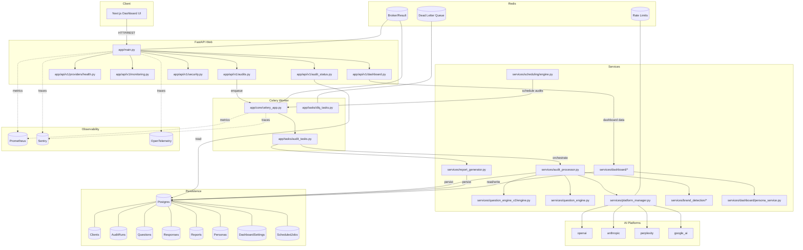

# AEO Audit Tool - Current Architecture (2025)

## Overview

The AEO (Answer Engine Optimization) Audit Tool is a comprehensive competitive intelligence platform that simulates user questions across multiple AI platforms to analyze brand visibility and competitive positioning. The system has evolved to include a full-featured dashboard interface, persona-driven question generation (v2), enhanced sentiment analysis, and advanced scheduling capabilities.

## System Architecture

### High-Level Architecture

```
┌─────────────────┐    ┌─────────────────┐    ┌─────────────────┐
│   Next.js       │────│  FastAPI Web    │────│   PostgreSQL    │
│   Dashboard     │    │   Application   │    │    Database     │
└─────────────────┘    └─────────────────┘    └─────────────────┘
                              │
                              │
                       ┌─────────────────┐    ┌─────────────────┐
                       │  Celery Worker  │────│   Redis Cache   │
                       │   (Background   │    │  & Message      │
                       │   Processing)   │    │    Broker       │
                       └─────────────────┘    └─────────────────┘
                              │
                    ┌─────────────────────────┐
                    │    AI Platforms         │
                    │  (OpenAI, Anthropic,    │
                    │  Perplexity, Google)    │
                    └─────────────────────────┘
```

### Mermaid Diagram



## Core Components

### 1. Web Application Layer (`app/main.py`)

**Purpose**: FastAPI-based REST API serving as the primary interface for audit operations and dashboard functionality.

**Key Features**:
- CORS middleware for cross-origin requests (configured for frontend at localhost:3000)
- Security headers and access logging via `SecurityHeadersMiddleware` and `AccessLogMiddleware`
- Prometheus metrics instrumentation
- Sentry integration for error monitoring
- OpenTelemetry distributed tracing with correlation IDs
- Multiple API routers:
  - `/api/v1/audits` - Core audit operations
  - `/api/v1/dashboard` - Dashboard-specific endpoints
  - `/api/v1/providers` - Platform health checks
  - `/api/v1/security` - Security and access control
  - `/api/v1/monitoring` - Observability endpoints

**Dependencies**:
- PostgreSQL database via SQLAlchemy ORM
- Redis for caching and session management
- Celery for asynchronous task processing

### 2. Database Layer

**Primary Database**: PostgreSQL

**Core Tables**:
- **Clients**: Brand/client information and competitors
- **AuditRuns**: Audit execution metadata and progress tracking
- **Questions**: Generated questions for AI platform testing
- **Responses**: AI platform responses with metadata
- **Reports**: Generated PDF reports and metadata
- **Personas**: User personas for question generation (NEW)
- **DashboardSettings**: Organization-level dashboard configuration (NEW)
- **DashboardMembers**: Team members in dashboard settings (NEW)
- **DashboardIntegrations**: Third-party integrations (NEW)
- **ScheduledJobs**: Scheduled audit runs and triggers (NEW)

**Cache Layer**: Redis
- Session management
- Rate limiting counters
- Temporary data storage for async operations
- Celery message broker
- Question generation caching

### 3. Frontend Layer (NEW)

#### 3.1 Next.js Dashboard (`frontend/`)

**Purpose**: Modern React-based dashboard for managing audits, personas, and insights

**Key Features**:
- TypeScript + Next.js 14 with App Router
- TanStack Query for data fetching and caching
- Tailwind CSS for styling with custom theme support
- Dark mode support via theme provider
- Real-time audit progress tracking
- Responsive design for mobile and desktop

**Pages**:
- `/overview` - Dashboard overview with KPIs
- `/audits` - Audit run management
- `/audits/run/[runId]` - Detailed audit run view
- `/personas` - Persona library and management
- `/insights` - AI-generated insights
- `/comparisons` - Competitive comparison matrices
- `/reports` - Report viewing and management
- `/settings` - Organization settings and configuration

**Components**:
- Audit run creation drawer with persona selection
- Test run launcher for quick experiments
- Report reader with PDF preview
- Insight cards and charts
- Settings panels for branding and integrations

### 4. Dashboard Services (NEW)

#### 4.1 Dashboard API Layer (`app/api/v1/dashboard.py`)

**Purpose**: Bridge backend data models to frontend data contracts

**Key Endpoints**:
- `GET /api/v1/dashboard/summary` - Audit program summaries
- `GET /api/v1/dashboard/runs` - List audit runs
- `GET /api/v1/dashboard/runs/{run_id}` - Detailed run view
- `POST /api/v1/dashboard/runs` - Create new audit run
- `GET /api/v1/dashboard/personas` - List personas
- `POST /api/v1/dashboard/personas` - Create persona
- `GET /api/v1/dashboard/insights` - List insights
- `GET /api/v1/dashboard/comparison` - Get comparison matrix
- `GET /api/v1/dashboard/settings` - Organization settings
- `POST /api/v1/dashboard/test-run` - Launch test run

#### 4.2 Dashboard Services (`app/services/dashboard/`)

**Service Modules**:
- **audit_run_service.py**: Transform audit runs into dashboard views
- **audit_run_creation_service.py**: Create audit runs with persona context (NEW)
- **audit_summary_service.py**: Aggregate audit program summaries
- **persona_service.py**: Manage persona CRUD operations (NEW)
- **persona_store.py**: Persona data persistence layer (NEW)
- **insight_service.py**: Generate actionable insights
- **comparison_service.py**: Build competitive comparison matrices
- **report_service.py**: Report metadata and summaries
- **settings_service.py**: Organization settings management (NEW)
- **test_run_service.py**: Quick test run execution (NEW)
- **widget_service.py**: Dashboard widget data providers
- **static_data.py**: Mock and seed data for development

### 5. Audit Orchestration System

#### 5.1 Audit Processor (`app/services/audit_processor.py`)

**Core Responsibility**: Main orchestrator for complete audit workflows

**Process Flow**:
1. **Initialization**: Load audit configuration and validate client data
2. **Question Generation**: Generate strategic questions using QuestionEngineV2 or V1
3. **Platform Coordination**: Distribute questions across available AI platforms
4. **Response Processing**: Collect and process AI responses with brand detection
5. **Progress Tracking**: Real-time progress updates with batch processing metrics
6. **Finalization**: Aggregate results and update audit status

**Key Features**:
- Batched processing with configurable batch sizes
- Circuit breaker patterns for platform failures
- Comprehensive error handling and retry logic
- Enhanced brand mention detection with sentiment analysis
- Platform-specific statistics and cost tracking

#### 5.2 Platform Manager (`app/services/platform_manager.py`)

**Purpose**: Centralized management of AI platform integrations

**Capabilities**:
- Dynamic platform initialization based on API key availability
- Health checking and availability monitoring
- Platform-specific configuration management
- Unified interface for heterogeneous AI platforms

**Supported Platforms**:
- OpenAI (GPT models)
- Anthropic (Claude models)
- Perplexity (web-augmented responses)
- Google AI (Gemini models)

#### 5.3 Question Engine V2 (NEW - `app/services/question_engine_v2/`)

**Function**: Persona-aware intelligent question generation with modular provider architecture

**Architecture**:
- **engine.py**: Main orchestrator for question generation
- **persona_extractor.py**: Extract and resolve persona context
- **providers/**: Modular question providers
  - **base.py**: Abstract provider interface
  - **template_provider.py**: Template-based question generation
  - **dynamic_provider.py**: AI-generated questions
- **evaluator/answer_eval.py**: Evaluate answer satisfaction
- **scoring.py**: Question prioritization and scoring
- **constraints.py**: Enforce question limits and constraints
- **cache.py**: Question caching layer
- **schemas.py**: Data contracts for persona requests

**Question Providers**:
- Template-based generation using industry catalogs
- Dynamic AI-powered generation for custom personas
- Industry-specific knowledge integration
- Context-aware question composition

**Persona Support**:
- Mode-based personas: "basic", "b2b", "b2c", "saas", "local", "ecommerce"
- Segment targeting and journey stage mapping
- Priority-based question weighting
- Multi-context support (industry, geography, use case)

**Prioritization System**:
- Category-based scoring (comparison, recommendation, alternatives)
- Strategic value weighting
- Dynamic question limiting based on constraints

#### 5.4 Question Engine V1 (Legacy - `app/services/question_engine.py`)

**Function**: Original question generation system (maintained for backward compatibility)

**Question Types**:
- Brand comparison scenarios
- Feature positioning queries
- Alternative-seeking questions
- Industry-specific inquiries
- Competitive recommendation scenarios

### 6. AI Platform Integration

#### 6.1 Base Architecture (`app/services/ai_platforms/base.py`)

**Design Pattern**: Abstract base class with standardized interface

**Core Methods**:
- `safe_query()`: Rate-limited queries with retry logic
- `extract_text_response()`: Platform-specific response parsing
- Context management for session handling

#### 6.2 Platform-Specific Implementations

Each platform client inherits from `BasePlatform` and implements:
- Authentication handling
- Request formatting
- Response parsing
- Error handling and rate limiting
- Cost calculation and token tracking

**Registry Pattern**: `PlatformRegistry` provides factory methods for platform instantiation

### 7. Background Processing (Celery)

#### 7.1 Task Architecture (`app/tasks/audit_tasks.py`)

**Primary Task**: `run_audit_task`
- Comprehensive audit execution with full error handling
- Automatic retry logic with exponential backoff
- Dead Letter Queue (DLQ) integration for failed tasks
- Progress tracking and metrics collection

**Supporting Tasks**:
- `generate_report_task`: PDF report generation
- `cleanup_old_audit_runs`: Maintenance and cleanup
- Various dashboard-related tasks

#### 7.2 Celery Configuration (`app/core/celery_app.py`)

**Settings**:
- JSON serialization for cross-platform compatibility
- UTC timezone standardization
- Task time limits (30-minute hard limit)
- Prefetch multiplier optimization
- Periodic DLQ processing (10-minute intervals)

### 8. Brand Detection and Sentiment Analysis

#### 8.1 Brand Detection Engine (`app/services/brand_detection/`)

**Core Capabilities**:
- Multi-language brand name normalization
- Fuzzy matching with configurable confidence thresholds
- Context window analysis for mention accuracy
- Market-specific adapters (German market support)

**Detection Pipeline**:
1. Text preprocessing and normalization (`core/normalizer.py`)
2. Brand name extraction using similarity algorithms (`core/similarity.py`)
3. Context validation and confidence scoring (`core/detector.py`)
4. Sentiment analysis integration (`core/sentiment.py`)

**Components**:
- **models/brand_mention.py**: Brand mention data models
- **market_adapters/**: Market-specific detection logic
- **utils/cache_manager.py**: Performance optimization
- **utils/performance.py**: Metrics and monitoring

#### 8.2 Sentiment Analysis (ENHANCED - `app/services/sentiment/`)

**Providers**:
- **vader_provider.py**: VADER sentiment analyzer for English text
- **transformer_provider.py**: Advanced transformer-based models
- **business_provider.py**: Business-context sentiment analysis (NEW)
- **efficient_transformer_provider.py**: Optimized transformer models (NEW)

**Core Components**:
- **core/engine.py**: Main sentiment analysis engine
- **core/models.py**: Sentiment data models
- **core/config.py**: Configuration management
- **integration.py**: Integration with brand detection
- **compat.py**: Backward compatibility layer

**Advanced Features (NEW)**:
- **optimization/model_manager.py**: Model lifecycle management
- **training/domain_adapter.py**: Domain-specific model training
- **cost_management/cost_monitor.py**: Cost tracking and optimization

**Enhanced Engine** (`enhanced_engine.py`):
- Multi-provider support with fallback
- Confidence scoring and validation
- Business context awareness
- Performance optimization

### 9. Report Generation System

#### 9.1 Report Generator (`app/services/report_generator.py`)

**Output Formats**: PDF reports with professional styling

**Report Types**:
- **Summary Reports**: High-level competitive insights
- **Detailed Reports**: Comprehensive analysis with response breakdowns
- **Competitive Reports**: Focus on competitive positioning

**Generation Pipeline**:
1. Data aggregation from multiple audit runs
2. Brand mention analysis and scoring
3. Competitive positioning calculation
4. Professional PDF rendering with charts and metrics

#### 9.2 Report Structure (`app/reports/v2/`)

**Components**:
- **chassis.py**: Main report generation framework
- **theme.py**: Visual styling and branding
- **metrics.py**: Metric calculation and formatting
- **accessibility.py**: Accessibility compliance (NEW)
- **charts.py**: Chart generation and visualization

**Sections**:
- **sections/summary.py**: Executive summary
- **sections/platforms.py**: Platform-specific analysis
- **sections/competitive.py**: Competitive breakdown
- **sections/recommendations.py**: Actionable recommendations

### 10. Scheduling System (NEW - `app/services/scheduling/`)

**Purpose**: Automated audit scheduling and execution

**Components**:
- **engine.py**: Main scheduling orchestrator
- **execution_manager.py**: Task execution coordination
- **repository.py**: Scheduled job persistence
- **health_monitor.py**: Scheduler health monitoring

**Triggers** (`triggers/`):
- **base.py**: Abstract trigger interface
- **cron_trigger.py**: Cron-based scheduling
- **interval_trigger.py**: Interval-based execution
- **date_trigger.py**: One-time scheduled runs
- **dependency_trigger.py**: Chain dependent audits
- **factory.py**: Trigger instantiation

**Policies** (`policies/`):
- **retry.py**: Retry logic for failed jobs
- **concurrency.py**: Concurrent execution limits
- **priority.py**: Job prioritization

**Integrations** (`integrations/`):
- **celery_integration.py**: Celery task integration
- **monitoring_integration.py**: Observability integration

### 11. Resilience and Monitoring

#### 11.1 Resilience Patterns (`app/utils/resilience/`)

**Circuit Breaker** (`circuit_breaker/`):
- **breaker.py**: Circuit breaker implementation
- **policies.py**: Failure detection policies
- **monitoring.py**: Circuit state monitoring

**Retry Logic** (`retry/`):
- **decorators.py**: Retry decorators
- **strategies.py**: Retry strategies
- **backoff.py**: Exponential backoff with jitter

**Bulkhead Isolation** (`bulkhead/`):
- **isolator.py**: Resource isolation
- **pools.py**: Connection pool management

**Dead Letter Queue** (`dead_letter/`):
- **queue.py**: DLQ implementation
- **processor.py**: Failed task processing
- **recovery.py**: Automated recovery strategies

**Monitoring** (`monitoring/`):
- **health.py**: Health check aggregation
- **alerts.py**: Alert generation and routing

#### 11.2 Observability Stack

**Metrics**: Prometheus integration with custom audit metrics
- Audit completion rates
- Platform response times
- Error rates by platform
- Brand detection accuracy
- Dashboard usage metrics (NEW)

**Logging**: Structured logging with correlation IDs
- Contextual logging per audit run
- Error aggregation and analysis
- Performance monitoring
- Request/response tracking

**Tracing**: OpenTelemetry distributed tracing
- Request flow tracking
- Performance bottleneck identification
- Cross-service visibility
- Correlation ID propagation

**Error Monitoring**: Sentry integration
- Automatic error capture and reporting
- Performance monitoring
- Release tracking
- User impact analysis

### 12. Security and Configuration

#### 12.1 Security Features

**Security Middleware**:
- **security/validation/security_headers.py**: Comprehensive security headers
- **security/audit/access_logger.py**: Detailed request/response logging
- **monitoring/tracing/correlation.py**: Correlation ID middleware

**Access Control**:
- **api/v1/security.py**: Authentication and authorization
- Token-based authentication
- Input sanitization and validation
- Field encryption for sensitive data

#### 12.2 Configuration Management (`app/core/config.py`)

**Environment-based Configuration**:
- Database connection settings
- AI platform API keys
- Resilience pattern parameters
- Security policy settings
- Monitoring and tracing configuration
- Frontend CORS origins
- Dashboard feature flags (NEW)

## Data Flow

### 1. Audit Initiation Flow

```
Dashboard UI → API Request → Client Validation → Persona Resolution (NEW)
     ↓
AuditRun Creation → Celery Task Enqueue → Background Processing
```

### 2. Audit Processing Flow

```
Task Start → Question Generation (V2 with Persona) → Platform Distribution → Batch Processing
     ↓
Response Collection → Brand Detection → Sentiment Analysis → Data Persistence → Progress Updates
     ↓
Audit Finalization → Report Generation → Task Completion → Dashboard Notification
```

### 3. Platform Query Flow

```
Question → Platform Selection → Rate Limit Check → API Call → Response Parse
     ↓
Brand Detection → Sentiment Analysis → Database Storage → Metrics Update → Dashboard Update
```

### 4. Dashboard Data Flow (NEW)

```
User Action (Frontend) → API Request → Dashboard Service → Data Transformation
     ↓
Database Query → View Model Creation → Response Serialization → Frontend Update
```

### 5. Persona-Driven Question Generation (NEW)

```
Persona Selection (UI) → Persona Extraction → Context Resolution → Provider Selection
     ↓
Question Generation → Scoring & Prioritization → Constraint Enforcement → Question List
```

## Deployment Architecture

### Docker Services

**Web Service**: FastAPI application with Gunicorn
**Worker Service**: Celery workers for background processing
**Database Service**: PostgreSQL with persistent volume
**Cache Service**: Redis for caching and message brokering
**Frontend Service**: Next.js application (NEW)

### Monitoring Stack

**Prometheus**: Metrics collection and storage
**Grafana**: Visualization and alerting
**Celery Exporter**: Celery-specific metrics
**Sentry**: Error tracking and performance monitoring

## Scalability Considerations

### Horizontal Scaling

**Web Layer**: Multiple FastAPI instances behind load balancer
**Frontend Layer**: CDN distribution for static assets (NEW)
**Worker Layer**: Auto-scaling Celery workers based on queue depth
**Database**: Read replicas for query-heavy workloads

### Performance Optimizations

**Caching**:
- Redis-based caching for frequently accessed data
- Question generation caching (NEW)
- Dashboard data caching (NEW)

**Connection Pooling**: Database connection optimization
**Batch Processing**: Configurable batch sizes for optimal throughput
**Rate Limiting**: Platform-specific rate limiting to prevent API quotas
**Frontend Optimization**: (NEW)
- TanStack Query for client-side caching
- Optimistic UI updates
- Lazy loading and code splitting

## Configuration and Environment

### Environment Variables

**Database**: Connection strings and credentials
**AI Platforms**: API keys and configuration
**Resilience**: Circuit breaker and retry parameters
**Security**: Encryption keys and security policies
**Monitoring**: Tracing and metrics endpoints
**Frontend**: CORS origins, API base URL (NEW)
**Dashboard**: Feature flags, theme settings (NEW)

### Runtime Configuration

**Audit Settings**: Batch sizes, timeouts, and limits
**Platform Settings**: Rate limits and model selections
**Brand Detection**: Confidence thresholds and caching
**Report Generation**: Templates and styling options
**Persona Settings**: Default personas, question limits (NEW)
**Scheduling Settings**: Trigger configurations, retry policies (NEW)

## Key Design Patterns

### 1. Command Pattern
Audit operations encapsulated as commands with full state management

### 2. Factory Pattern
Platform-specific client instantiation through PlatformRegistry

### 3. Observer Pattern
Progress tracking and metrics collection through event-driven updates

### 4. Strategy Pattern
Configurable sentiment analysis providers and report generation strategies

### 5. Circuit Breaker Pattern
Platform resilience through failure detection and automatic recovery

### 6. Provider Pattern (NEW)
Modular question generation providers with pluggable architecture

### 7. Repository Pattern (NEW)
Dashboard services abstract data access through repository interfaces

### 8. View Model Pattern (NEW)
Dashboard data contracts separate from database models

## Integration Points

### External Dependencies

**AI Platform APIs**: Primary data source for competitive intelligence
**Database Systems**: Data persistence and query optimization
**Message Brokers**: Asynchronous task coordination
**Monitoring Systems**: Observability and alerting infrastructure
**Frontend Framework**: React/Next.js for UI (NEW)

### Internal Service Communication

**Synchronous**: REST API for immediate operations
**Asynchronous**: Celery tasks for long-running processes
**Event-driven**: Progress updates and metrics collection
**Client-Server**: Frontend-backend communication via REST API (NEW)

## Recent Major Enhancements

### 1. Dashboard UI (2025)
- Full-featured Next.js dashboard
- Real-time audit tracking
- Persona management interface
- Insight visualization
- Settings and configuration panels

### 2. Question Engine V2 (2025)
- Persona-aware question generation
- Modular provider architecture
- AI-powered dynamic generation
- Enhanced scoring and prioritization
- Multi-context support

### 3. Enhanced Sentiment Analysis (2025)
- Business-context sentiment provider
- Cost management and optimization
- Domain adaptation capabilities
- Multi-provider support with fallback

### 4. Scheduling System (2025)
- Automated audit scheduling
- Multiple trigger types (cron, interval, dependency)
- Retry policies and concurrency control
- Health monitoring

### 5. Persona Management (2025)
- Database-backed persona storage
- CRUD operations via API
- Persona library and catalog
- Clone and compose operations
- Integration with question engine

This architecture provides a robust, scalable, and maintainable foundation for competitive intelligence gathering across multiple AI platforms, with a modern dashboard interface, persona-driven insights, comprehensive monitoring, error handling, and advanced reporting capabilities.
