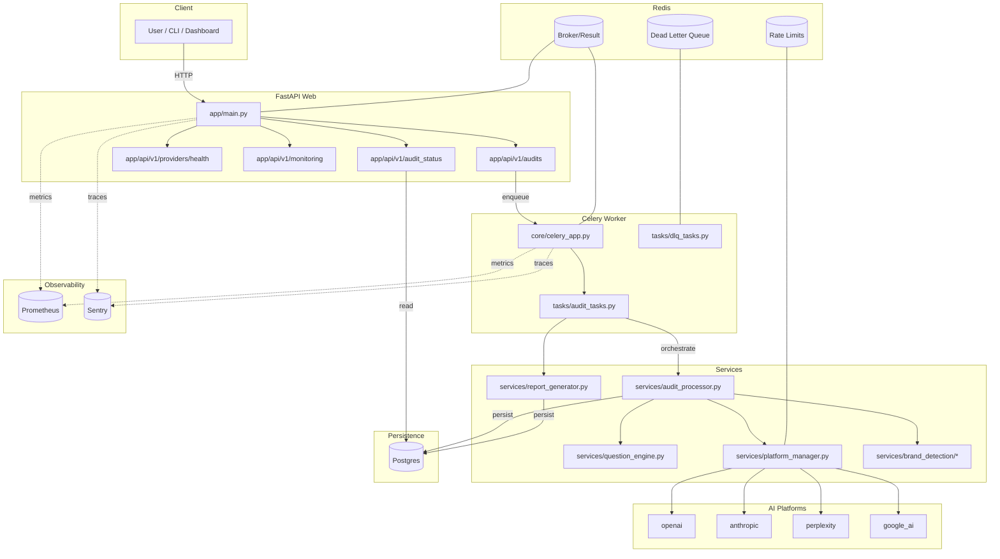

# AEO Audit Tool — Architecture Plan (Codex)

> Best‑of‑class architectural blueprint for the AEO Competitive Intelligence Tool. This plan maps how the system fits together, the runtime responsibilities of each component, the end‑to‑end data/processing flows, and the key extension points. Paths below reference concrete files in this repo so engineers can jump straight to code.

---

## 1) System Context

- Business goal: Run competitive AEO audits against multiple AI platforms, detect brand mentions/sentiment, and generate client‑ready reports.
- Core capabilities:
  - API to trigger and track audits and reports
  - Orchestrated audit pipeline (question generation → AI queries → detection → persistence)
  - Multi‑platform LLM client layer with resilience
  - Report generation (classic and v2) with metrics/insights
  - Scheduling of recurring jobs; DLQ + replay
  - Observability (metrics/logs/tracing) and security hardening

High‑level runtime view

```
+---------------------------+
|        Clients            |
|  (Dashboards/CI/CLI)      |
+------------+--------------+
             | HTTP
             v
     +-------+-------------------+         +-------------------+
     |        FastAPI Web        |  enq    |    Celery Worker  |
     |  app/main.py              +-------->+  app/core/celery* |
     |  app/api/v1/*             |         |  app/tasks/*      |
     +------+--------------------+         +---------+---------+
            | DB (SQLAlchemy)                        |
            v                                        v
     +------+--------------------+          +--------+------------------+
     |      Postgres             |          |  AI Platforms (Clients)  |
     |  app/db/*  app/models/*   |          |  app/services/ai_*       |
     +---------------------------+          +--------+------------------+
                                                     |
                                                     v
                                           +---------+---------+
                                           | Brand Detection    |
                                           | app/services/brand*|
                                           +---------+---------+
                                                     |
                                                     v
                                          +----------+----------+
                                          | Report Generation   |
                                          | app/services/report*|
                                          +----------+----------+


Supporting infra: Redis (broker/cache/rate‑limit), Prometheus/Grafana, Sentry/OTEL
```

Mermaid diagram



Key infrastructure
- Web/API: FastAPI app exposes versioned routes under `/api/v1`
- Worker: Celery (Redis broker/result) executes long‑running audit/report tasks
- Data: Postgres via SQLAlchemy; Alembic migrations keep schema in sync (`alembic/`)
- Cache/Queue/Rate‑limit: Redis (DLQ, token buckets, Celery broker/backend)
- Observability: Prometheus metrics (API + domain), Grafana dashboards, optional Sentry, optional OpenTelemetry

---

## 2) Component Map and Responsibilities

API layer
- `app/main.py`: App init, CORS, security middlewares, Prometheus instrumentation; mounts routers
- `app/api/v1/audits.py`: Trigger audit run, poll status, generate report, report status
- `app/api/v1/audit_status.py`: Rich status/progress, system status, metrics views
- `app/api/v1/providers/health.py`: Provider health aggregation
- `app/api/v1/monitoring.py`: Lightweight monitoring snapshot

Tasks and orchestration
- `app/core/celery_app.py`: Celery app, Sentry, beat (periodic DLQ processor)
- `app/tasks/audit_tasks.py`: Run audit (async), generate report, cleanup, DLQ signal handling
- `app/tasks/dlq_tasks.py`: Periodic DLQ processing and resubmission

Audit pipeline (services)
- `app/services/audit_processor.py`: Orchestrator for full audit lifecycle
  - Loads audit config, prepares context, generates/prioritizes questions
  - Fans out per‑platform queries with progress tracking and metrics
  - Runs brand detection on responses; persists everything; finalizes status
- `app/services/question_engine.py`: Multi‑provider question generation (concurrent)
  - Providers: `app/services/providers/template_provider.py`, `.../dynamic_provider.py`
- `app/services/platform_manager.py`: Central registry, availability and health of platforms
- `app/services/ai_platforms/*`: Resilient, normalized clients per platform
  - `base.py`: Redis token bucket or in‑proc limiter, bulkhead, circuit breaker, retry backoff
  - Implementations: `openai_client.py`, `anthropic_client.py`, `perplexity_client.py`, `google_ai_client.py`
  - `registry.py`: name→class factory
- `app/services/brand_detection/*`: Text normalization, fuzzy/semantic matching, sentiment, market adapters
- `app/services/report_generator.py`: PDF generation (classic) and v2 handoff to `app/reports/v2/engine.py`

Scheduling (recurring jobs)
- `app/services/scheduling/*`: Repository, triggers, policies, execution manager
- `app/services/scheduling/integrations/celery_integration.py`: Bridge to Celery (submit/track/cancel)
- Models: `app/models/scheduling.py` (jobs, executions, locks, metrics, dependencies)

Persistence and data model
- ORM base and session: `app/db/base.py`, `app/db/session.py`
- Core models: `app/models/audit.py`, `app/models/question.py`, `app/models/response.py`, `app/models/report.py`
- Scheduling models: `app/models/scheduling.py`

Utilities and resilience
- Logging and structure: `app/utils/logger.py`
- Error taxonomy/handler: `app/utils/error_handler.py`
- Redis token bucket: `app/utils/rate_limiter.py`
- Resilience primitives: `app/utils/resilience/*` (bulkhead, circuit breaker, retry, DLQ)

Security and compliance
- Headers, input validation, schema validation: `app/security/validation/*`
- Auth: `app/security/auth/jwt_handler.py`, `session_manager.py`
- Encryption and key management: `app/security/encryption/*`
- Access logs and audit: `app/security/audit/*`

Observability
- Domain metrics: `app/services/audit_metrics.py`
- API metrics: Instrumentator in `app/main.py`
- Tracing and correlation: `app/monitoring/tracing/*`
- Dashboards/rules: `monitoring/prometheus/*`, `monitoring/grafana/*`

Configuration
- App settings (env‑driven): `app/core/config.py`
- Platform defaults and key mapping: `app/core/platform_settings.py`

---

## 3) Core Data Model (Simplified)

- Client (`app/models/audit.py:Client`): id, name, industry, product_type, competitors
- AuditRun (`app/models/audit.py:AuditRun`): id, client_id, config JSON, status, timestamps, totals, progress_data, platform_stats, error_log
- Question (`app/models/question.py:Question`): id, audit_run_id, question_text, category, type, priority_score, provider, cost/tokens, metadata
- Response (`app/models/response.py:Response`): id, audit_run_id, question_id, platform, response_text, raw_response JSON, brand_mentions JSON, processing_time_ms
- Report (`app/models/report.py:Report`): id, audit_run_id, file_path, report_type(+v2 template_version/theme)
- Scheduling (`app/models/scheduling.py`): ScheduledJob, JobExecution, JobDependency, SchedulerLock, SchedulerMetrics

---

## 4) End‑to‑End Flows

4.1 Trigger an audit (HTTP → Celery → Services)
1) Client calls `POST /api/v1/audits/configs/{client_id}/run` (`app/api/v1/audits.py`)
2) API validates client, inserts `AuditRun(status=pending)`, enqueues `run_audit_task.delay(audit_run_id)`
3) Worker (`app/tasks/audit_tasks.py`) loads run, sets status=running, initializes `PlatformManager` and `AuditProcessor`
4) `AuditProcessor` (`app/services/audit_processor.py`):
   - Builds execution context (client, competitors, selected platforms)
   - Calls `QuestionEngine.generate_questions(...)` with providers (template + dynamic)
   - Persists generated questions; sets `total_questions`
   - Processes in batches: for each question × platform → `Platform.safe_query()`
   - Extracts text, runs brand detection, persists `Response`
   - Updates progress each batch; metrics for latency, errors, cost/tokens
5) Finalize run → status=completed or failed; platform_stats summary; progress gauge cleared

4.2 Generate report
- On demand via `POST /api/v1/audits/runs/{run_id}/generate-report` (sync call) or Celery task `generate_report_task`
- `app/services/report_generator.py` builds classic PDF or dispatches to `app/reports/v2/engine.py` for enhanced v2
- Persists `Report` row and returns path; `GET /api/v1/audits/runs/{run_id}/report` to fetch status

4.3 Progress, health, and monitoring
- `GET /api/v1/audit-status/audit-runs/{id}`: rich detail from DB + computed metrics
- `GET /api/v1/audit-status/system`: platform health via `PlatformManager`, audit stats
- `GET /api/v1/providers/health`: per‑provider health for question generation
- `GET /api/v1/monitoring/snapshot`: DLQ snapshot, process cpu/mem; hints to dashboards

4.4 Scheduling recurring work
- Jobs persisted in `scheduled_jobs`; triggers (`cron/interval/date/dependency`) compute next runs
- Bridge (`app/services/scheduling/integrations/celery_integration.py`) submits jobs to Celery and tracks completion/cancel
- Audit/report cleanup tasks available and schedulable

4.5 DLQ operations and error reproduction
- On hard failure, `DeadLetterQueue` (`app/utils/resilience/dead_letter/*`) stores payload in Redis `dlq:audit:tasks`
- Periodic `process_audit_dlq` requeues; ad‑hoc via `scripts/requeue_dlq.py`
- Reproduction helper: `scripts/reproduce_error.py` (HTTP guidance + Celery pointers)

---

## 5) Resilience and Error Handling

- Platform clients (`ai_platforms/base.py`):
  - Rate limiting: Redis token bucket (`app/utils/rate_limiter.py`) with in‑proc fallback
  - Bulkhead isolation: concurrency caps per platform
  - Circuit breaker: open/half‑open/closed with recovery timeouts
  - Retries: exponential backoff with jitter for transient/rate‑limit errors
  - Normalized response envelope with timing metadata
- Error taxonomy and handler: `app/utils/error_handler.py`
  - Standard categories (configuration, auth, platform, network, database, validation, system, rate_limit, timeout)
  - Severity mapping → logging level, metrics, recovery hints
  - API middleware compatibility; integrates with domain metrics (`app/services/audit_metrics.py`)
- DLQ: structured payloads, max retries, retention; processing and replay tooling

---

## 6) Observability and SLOs

- FastAPI metrics: `prometheus_fastapi_instrumentator` in `app/main.py`
- Domain metrics: `app/services/audit_metrics.py` (audit counts, batch timings, platform latency/errors, tokens, costs, progress gauge)
- Dashboards: `monitoring/grafana/dashboards/aeo-overview.json`; Prom targets in `monitoring/prometheus/prometheus.yml`
- Tracing: `app/monitoring/tracing/opentelemetry_setup.py` (optional OTEL exporter); request correlation IDs via `CorrelationIdMiddleware`
- Sentry: configured in both API and Celery when `SENTRY_DSN` present
- Runbooks: `docs/runbooks/*` (e.g., `dlq_depth_high.md`)

Operational expectations
- PRs run unit/integration subsets; nightly runs full suite and chaos/security when enabled
- Key SLOs (suggested):
  - API p95 latency < 200ms for health/status endpoints
  - Single audit end‑to‑end ≤ 5 minutes for default question count
  - DLQ drained within 15 minutes of bursts

---

## 7) Security Model

- Ingress: CORS configured; security headers middleware (`app/security/validation/security_headers.py`)
- Input: sanitizer and schema validation (`app/security/validation/*`)
- AuthN/Z: JWT and session support (`app/security/auth/*`); pluggable API key patterns in config
- Secrets: env‑driven via `app/core/config.py`; avoid committing keys; support for encryption (`app/security/encryption/*`)
- Audit/Access logs: `app/security/audit/access_logger.py`; attach correlation/request IDs

---

## 8) Configuration

- Source of truth: `app/core/config.py` (`Settings` via Pydantic BaseSettings)
  - Postgres/Redis, platform keys, resilience knobs, DLQ, security flags
  - Derived `database_url` used by `app/db/session.py`
- Platform defaults & key mapping: `app/core/platform_settings.py`
  - `PLATFORM_CONFIGS` (rate limits, models, timeouts) and `REQUIRED_ENV_VARS`
- Docker Compose services: `docker-compose.yml` (db, redis, web, worker, exporter)
- K8s manifests: `deployment/k8s/*.yml`; Terraform scaffolding under `deployment/terraform/`

---

## 9) Developer Workflows (Runbooks)

Local bring‑up
- Ensure `.env` with DB/Redis creds and platform keys as needed
- Start infra: `docker-compose up -d db redis`
- Start web: `docker-compose up -d web`
- Start worker: `docker-compose up -d worker`
- Health checks: `GET /health`, `GET /api/v1/health`, `GET /api/v1/providers/health`

Trigger an audit and report
- Create a client row (see `scripts/create_test_client.py`) or use fixtures
- `POST /api/v1/audits/configs/{client_id}/run` → returns `audit_run_id`
- Poll: `GET /api/v1/audits/runs/{audit_run_id}/status` or rich `GET /api/v1/audit-status/audit-runs/{id}`
- Generate: `POST /api/v1/audits/runs/{id}/generate-report` (sync) or enqueue Celery task

DLQ and error reproduction
- Inspect DLQ: `python scripts/requeue_dlq.py --queue audit:tasks --action stats`
- Process DLQ: `python scripts/requeue_dlq.py --queue audit:tasks --action process --max 100`
- Reproduce: `python scripts/reproduce_error.py --incident reports/incidents/incident_YYYY.json --mode http`

Testing & quality gates
- See `docs/buildplans/TESTING_SCRATCHPAD.md` for markers and run commands
- Typical: `pytest -q -m "unit and not slow"`; full: `pytest -m "not slow"`
- Lint/types: `ruff check . && mypy app`

---

## 10) Extension Points (How‑Tos)

Add a new AI platform client
- Implement subclass of `BasePlatform` under `app/services/ai_platforms/`
  - Provide `_get_endpoint_url`, `_get_default_headers`, `_prepare_request_payload`, `query`, `extract_text_response`
- Register in `app/services/ai_platforms/registry.py` and add config in `app/core/platform_settings.py`
- Expose API key env var in `REQUIRED_ENV_VARS`; set key in `.env`

Add a new question provider
- Implement `QuestionProvider` protocol in `app/services/providers/`
- Add to default provider list in `QuestionEngine` or inject via DI/tests

Add a market adapter for brand detection
- Create module under `app/services/brand_detection/market_adapters/`
- Wire any language/market rules; ensure tests under `app/services/brand_detection/tests/`

Add/modify report sections
- Classic: expand builders in `app/services/report_generator.py`
- v2: add sections in `app/reports/v2/sections/*`, update `engine.py`

Schedule recurring audits
- Use scheduling API layer (to build) or write via repository to `scheduled_jobs`
- Ensure Celery bridge maps job type to a concrete task name

---

## 11) Notable Design Choices

- Strong separation between orchestration (`AuditProcessor`) and execution clients (platform adapters)
- Resilience built into platform layer (rate limit, breaker, bulkhead, retry)
- Progress tracking and metrics designed for dashboards and alerting
- DLQ present for safe failure handling and replay in production
- v2 report engine embraces proper sentiment and SAIV metrics with theming

---

## 12) Known Gaps / Follow‑ups

- Ensure all platform API keys are set for multi‑provider audits; otherwise `PlatformManager` gracefully skips
- Tighten CORS/headers for production; integrate API auth consistently across routes
- Expand scheduling API endpoints for CRUD of jobs and real‑time status
- Consider snapshot storage for reproducibility of report inputs
- Align Celery task names with scheduler‑bridge defaults if used broadly

---

## 13) Quick File Jump Table

- API: `app/api/v1/audits.py`, `app/api/v1/audit_status.py`, `app/api/v1/providers/health.py`, `app/api/v1/monitoring.py`
- Orchestration: `app/services/audit_processor.py`, `app/tasks/audit_tasks.py`, `app/core/celery_app.py`
- Platforms: `app/services/ai_platforms/*`, `app/services/platform_manager.py`, `app/core/platform_settings.py`
- Brand Detection: `app/services/brand_detection/*`
- Reports: `app/services/report_generator.py`, `app/reports/v2/engine.py`
- Scheduling: `app/services/scheduling/*`, `app/models/scheduling.py`
- Data: `app/db/base.py`, `app/db/session.py`, `app/models/*`
- Resilience: `app/utils/resilience/*`, `app/utils/error_handler.py`, `app/utils/rate_limiter.py`
- Security: `app/security/*`
- Observability: `app/services/audit_metrics.py`, `monitoring/*`, `app/monitoring/tracing/*`

---

This plan is intentionally code‑anchored and production‑oriented. With it, engineers should be able to navigate, operate, and extend the system confidently.
