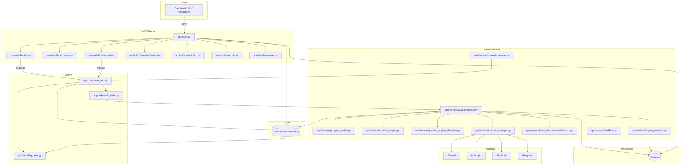
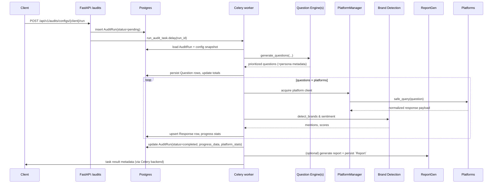

# AEO Audit Tool — Architecture Plan (Current)

> Working blueprint for the current codebase. Use this to understand how runtime components fit together, what each module owns, and where to extend the system safely.

---

## 1. System Context

- Mission: simulate real user discovery journeys across multiple AI engines, capture competitor visibility, and deliver insight-rich reports for agencies.
- Core capabilities in production today:
  - FastAPI surface that creates audits, tracks detailed status, exposes dashboard data, and guards secure routes.
  - Celery-based pipeline that generates questions, queries AI platforms, performs brand/sentiment detection, and stores results.
  - Dual question engines (v1 + v2) with deterministic templates, dynamic LLM generation, persona handling, and caching.
  - Resilient AI platform client layer with rate limiting, retries, and platform registry management.
  - PDF reporting stack (classic + v2 theming) writing to `reports/` and persisting metadata.
  - Scheduling scaffolding, DLQ processing, and dashboard persona utilities for the upcoming SaaS surface.
  - Observability via structured logging, Prometheus metrics, tracing hooks, and security/audit middleware.

High-level runtime view

```
+-----------------------------+             +-----------------------------+
|          Clients            |             |      Background Workers      |
| Dashboards / Integrations   |             | Celery + Redis (broker/DLQ)  |
+--------------+--------------+             +--------------+--------------+
               | HTTP                                        | tasks
               v                                              v
      +--------+-------------------+      enqueue     +-------+-------------------+
      |        FastAPI service     +----------------->+   Celery worker pool    |
      |  app/main.py               |                  |   app/tasks/audit_*     |
      |  app/api/v1/* routers      |                  |   app/tasks/dlq_tasks.py |
      +-----+----------------------+                  +-----------+--------------+
            | SQLAlchemy sessions                                |
            v                                                    v
      +-----+----------------------+                +------------+---------------+
      |        Postgres DB         |                |   AI platform clients      |
      | app/db/*  app/models/*     |                | app/services/ai_platforms/*|
      +-----+----------------------+                +------------+---------------+
            ^                                                    |
            | Redis cache / DLQ                                   v
      +-----+----------------------+                +------------+---------------+
      | Redis (cache, rate limit,  |                | Brand detection, reports   |
      | broker, DLQ metadata)      |                | app/services/brand_*       |
      +----------------------------+                | app/services/report_*      |
                                                    +---------------------------+

Support: Prometheus/Grafana (metrics), Sentry/OTEL (tracing), security middleware.
```

Mermaid component map



---

## 2. Runtime Components & Responsibilities

- **FastAPI service** (`app/main.py`)
  - Boots structured logging, Sentry (when `SENTRY_DSN` set), CORS, security headers, access logging, correlation IDs, and Prometheus instrumentation (`Instrumentator`).
  - Mounts routers for audits, audit status, dashboard, personas, provider health, monitoring snapshots, and secure ping endpoints.

- **API routers**
  - `app/api/v1/audits.py`: create audits, poll status, synchronously trigger PDF generation, and surface latest report metadata.
  - `app/api/v1/audit_status.py`: rich status surface with platform metrics, progress snapshots, stage history, and computed KPIs.
  - `app/api/v1/dashboard.py`: dashboard-oriented reads/writes (audit run listings, persona CRUD, insights, settings) with JWT auth enforcement via `_authorize`.
  - `app/api/v1/providers/health.py`: concurrent provider health checks over the configured question providers.
  - `app/api/v1/personas.py`: read-only persona catalog exposure for the front-end persona composer.
  - `app/api/v1/monitoring.py`: lightweight ops snapshot (DLQ depth, process CPU/mem, Grafana/Prom hints).
  - `app/api/v1/security.py`: secure ping backed by JWT verification (`app/security/auth/jwt_handler.py`).

- **Celery runtime**
  - `app/core/celery_app.py` wires broker/backend (Redis), structured logging, optional Sentry integration, worker limits, and beat schedule for DLQ replays.
  - `app/tasks/audit_tasks.py` hosts `run_audit_task` async orchestrator with retry/backoff, progress tracking, DLQ integration, and audit metrics.
  - `app/tasks/dlq_tasks.py` drains `dlq:audit:tasks` via `DeadLetterQueue`, re-submitting audit runs when allowed.

- **Audit orchestration** (`app/services/audit_processor.py`)
  - Loads `AuditRun`, updates lifecycle state, coordinates question generation (v1/v2), batches platform calls, records metrics, persists responses, and finalizes status/metrics.
  - Pulls settings from `app/core/audit_config.py` for batch sizing, retries, timeouts, and platform throttles.

- **Progress tracking** (`app/services/progress_tracker.py`)
  - Persists granular progress snapshots, stage transitions, batch stats, and ETA estimates back onto the `AuditRun` JSON columns.

- **Question engines**
  - v1 orchestrator (`app/services/question_engine.py`) fans out to `TemplateProvider`, `DynamicProvider`, and additional providers under `app/services/providers/*` using async concurrency + metrics.
  - v2 engine (`app/services/question_engine_v2/engine.py` + `schemas.py`) adds persona-aware mixes, quotas, scoring, and caching; toggled by `settings.QUESTION_ENGINE_V2`.
  - Persona catalogs, composer utilities, and caches live under `app/services/question_engine_v2/{catalogs,persona_extractor,cache.py}`.

- **AI platform clients**
  - Shared base (`app/services/ai_platforms/base.py`) implements async session mgmt, rate limiting (`AIRateLimiter`), retries, error taxonomy, and safe query contract.
  - Concrete adapters: `openai_client.py`, `anthropic_client.py`, `perplexity_client.py`, `google_ai_client.py`; all registered through `app/services/ai_platforms/registry.py` and configured via `app/core/platform_settings.py`.
  - `app/services/platform_manager.py` lazily instantiates available platforms based on env keys, exposes health checks, and is the single entry for the audit processor.

- **Brand detection & sentiment**
  - Core detection engine lives in `app/services/brand_detection/core/detector.py`, with helper modules for normalisation, similarity, and sentiment weighting.
  - Market/language adapters under `app/services/brand_detection/market_adapters/` and typed results in `app/services/brand_detection/models/`.
  - Extended sentiment modelling, cost management, and optimisation features exist in `app/services/sentiment/*` for future integration.

- **Reporting pipeline**
  - Legacy & v2 report builders in `app/services/report_generator.py`, bridging to PDF layout helpers in `app/services/report_utils.py`.
  - v2 theming, sections, charts, and accessibility helpers housed in `app/reports/v2/*` (notably `engine.py`, `sections/`, `theme.py`).
  - Generated PDFs recorded in Postgres via `app/models/report.py` and stored on disk under `reports/`.

- **Dashboard & personas services** (`app/services/dashboard/*`)
  - Services compose dashboard DTOs (audit summaries, persona libraries, reports, widgets) and enforce persona ownership (`persona_service.py`, `persona_store.py`).
  - Launch test runs and simulated insights through `test_run_service.py` and `insight_service.py` using deterministic fixtures (`static_data.py`).

- **Scheduling system scaffolding**
  - Rich model layer in `app/models/scheduling.py` and service-side orchestration under `app/services/scheduling/*` (engine, policies, repository, triggers, health monitor).
  - Not yet wired to API but ready for recurring audits once Celery bridges are finalised.

- **Persistence**
  - SQLAlchemy base in `app/db/base_class.py`; master import list `app/db/base.py` for ALEMBIC.
  - Session factory `app/db/session.py` using `settings.database_url`.
  - Domain models in `app/models/{audit,question,response,report,persona,dashboard,scheduling}.py`.

- **Caching & rate limiting**
  - Redis-backed async cache manager `app/utils/cache.py` with deterministic key gen for dynamic questions.
  - API-side rate limiting stubs in `app/utils/rate_limiter.py`; platform bulkhead/queue controls in `app/utils/resilience/*`.

---

## 3. End-to-End Flows

### Audit run execution



### Report generation trigger
- `POST /api/v1/audits/runs/{id}/generate-report` executes synchronously inside the API process.
- `app/services/report_generator.py` loads audit + responses, chooses classic vs v2 flow, builds PDF, writes to disk, and persists `Report` row.

### Provider health & monitoring
- `GET /api/v1/providers/health` iterates `QuestionEngine.providers`, awaits `health_check` concurrently, and returns consolidated status (503 when any fail).
- `GET /api/v1/monitoring/snapshot` uses `ResilienceHealthChecker` (`app/utils/resilience/monitoring/health.py`) plus `psutil`/`os` fallbacks to surface DLQ depths and process resource usage.

### Dashboard + personas flow
- Authenticated dashboard requests call into `app/services/dashboard/*` which assemble data from Postgres (`SessionLocal`) and static fixtures.
- Persona CRUD endpoints validate ownership, leverage persona catalogs (`app/services/question_engine_v2/persona_extractor.py`), and persist entries in `app/models/persona.py`.

---

## 4. Data Model Highlights

- `app/models/audit.py`
  - `Client`: agency/customer metadata, competitor lists, relationship to audit runs.
  - `AuditRun`: config snapshot (JSON), lifecycle timestamps, progress/platform stats JSON blobs, FK links to client/questions/responses/report.
- `app/models/question.py`: prioritized questions with provider metadata, persona context, scoring, and token/cost tracking (indexed by persona & context stage).
- `app/models/response.py`: normalized responses per platform, raw payloads, brand mentions JSON, timing/cost metrics, optional satisfaction fields.
- `app/models/report.py`: generated report metadata (path, type, template version, theme).
- `app/models/persona.py`: user-owned persona compositions with catalog metadata and contexts.
- `app/models/dashboard.py`: agency dashboard settings, members, integrations, widgets.
- `app/models/scheduling.py`: comprehensive scheduling schemas (`ScheduledJob`, `JobExecution`, dependencies, policies) for future automation.

All models inherit from `app/db/base_class.py` and are registered in `app/db/base.py` for Alembic discovery.

---

## 5. Observability, Resilience & Operations

- **Structured logging**: `app/utils/logger.py` builds `structlog` configuration shared by API and workers. Context helpers (`app/services/audit_context.py`) bind audit, stage, and platform metadata to every log line.
- **Metrics**:
  - Prometheus integration via `Instrumentator` plus counters/histograms in `app/services/audit_metrics.py` and provider metrics in `app/services/metrics.py`.
  - Domain metrics exported for question providers, platform latency, cache hits, DLQ depth, etc.
- **Progress telemetry**: `app/services/progress_tracker.py` updates `AuditRun.progress_data`, enabling `app/api/v1/audit_status.py` to render live dashboards and compute duration/response KPIs.
- **Resilience building blocks**:
  - Circuit breaker, retry, bulkhead utilities under `app/utils/resilience/{circuit_breaker,retry,bulkhead}`.
  - DLQ processor and recovery routines in `app/utils/resilience/dead_letter/*` power `process_audit_dlq`.
  - Platform rate limiting and concurrency safeties (`AIRateLimiter`, audit settings) keep API usage within quotas.
- **Tracing & alerts**: `app/monitoring/tracing/opentelemetry_setup.py` and `correlation.py` enable OTEL export and propagation when toggled. Sentry integrated in both API (`app/main.py`) and Celery (`app/core/celery_app.py`).
- **Dashboards & runbooks**: Prometheus/Grafana manifests under `monitoring/`, ops guides in `docs/runbooks/` (e.g., DLQ triage, incident response).

---

## 6. Security & Access Controls

- **Inbound security**: configurable CORS plus `SecurityHeadersMiddleware` (`app/security/validation/security_headers.py`) and `AccessLogMiddleware` (`app/security/audit/access_logger.py`).
- **Authentication**: JWT verification via `app/security/auth/jwt_handler.py`; `app/api/v1/security.py` and dashboard routes enforce bearer tokens.
- **Validation**: schema validators, sanitizers, and threat detection layers in `app/security/validation/*` and `app/security/monitoring/*`.
- **Secret management**: environment-driven settings from `app/core/config.py`, optional field encryption utilities in `app/security/encryption/*`.
- **Audit/compliance**: audit logging helpers (`app/security/audit/change_tracker.py`, `compliance.py`) prepared for regulated environments.

---

## 7. Configuration & Environment

- `app/core/config.py`: Pydantic settings for database, Redis, AI keys, security flags, tracing, and question engine toggles. Auto-adjusts service hosts outside Docker and generates dev-only secret keys.
- `app/core/audit_config.py`: fine-grained audit processor configuration (batch size, timeouts, retry strategy, concurrency caps, mock toggles).
- `app/core/platform_settings.py`: per-platform defaults (model, timeout, RPM), environment variable mapping, and helper getters.
- `.env` template lives at repo root; docker-compose files bootstrap Postgres, Redis, API, worker, and exporters. Kubernetes/Terraform manifests reside in `deployment/`.

---

## 8. Developer Workflow & Testing

- **Local bring-up**
  - Install deps, run `uvicorn app.main:app --reload` and `celery -A app.tasks.audit_tasks worker --loglevel=info` (or use `docker-compose up web worker`).
  - Seed clients via `scripts/create_test_client.py` or fixtures under `tests/`.
  - Health checks: `/health`, `/api/v1/providers/health`, `/api/v1/monitoring/snapshot`.

- **Quality gates**
  - Tests: `pytest` or focused runs (e.g., `pytest tests/services/test_audit_processor.py`).
  - Lint/type: `ruff check .`, `mypy app` (mirrors `make healthcheck`).
  - Optional notebook/example flows in `examples/` for sentiment and report validation.

- **Observability during dev**
  - Prometheus endpoint `/metrics`; dashboards defined under `monitoring/grafana/`.
  - DLQ scripts (`scripts/requeue_dlq.py`, `scripts/reproduce_error.py`) aid failure drills.

---

## 9. Extension Points

1. **Add AI platform**
   - Implement subclass in `app/services/ai_platforms/`, register via `registry.py`, add defaults to `platform_settings.py`, expose env var, and ensure health checks succeed.
2. **New question provider or persona mode**
   - Create provider under `app/services/providers/` or v2 provider module, wire into `QuestionEngine` / `build_default_engine`, and add Prometheus labels.
3. **Brand detection enhancements**
   - Extend `market_adapters/` or sentiment providers, adjust `BrandDetectionEngine` config, add tests in `app/services/brand_detection/tests/`.
4. **Scheduling automation**
   - Use `app/services/scheduling/repository.py` and `engine.py` to persist `ScheduledJob` definitions, then hook into Celery or API endpoints.
5. **Dashboard features**
   - Extend DTOs in `app/api/v1/dashboard_schemas.py`, update corresponding service under `app/services/dashboard/`, and maintain persona ownership checks.
6. **Report sections/themes**
   - Modify classic builders in `app/services/report_generator.py` or add v2 sections under `app/reports/v2/sections/`, updating `engine.py` and theme definitions.

---

## 10. Quick File Jump Table

- API surface: `app/main.py`, `app/api/v1/{audits.py,audit_status.py,dashboard.py,providers/health.py,monitoring.py,security.py,personas.py}`.
- Task orchestration: `app/core/celery_app.py`, `app/tasks/{audit_tasks.py,dlq_tasks.py}`.
- Audit pipeline: `app/services/{audit_processor.py,audit_context.py,audit_metrics.py,progress_tracker.py}`.
- Question generation: `app/services/question_engine.py`, `app/services/question_engine_v2/*`, `app/services/providers/*`.
- Platform layer: `app/services/ai_platforms/*`, `app/services/platform_manager.py`, `app/core/platform_settings.py`.
- Brand & sentiment: `app/services/brand_detection/*`, `app/services/sentiment/*`.
- Reporting: `app/services/report_generator.py`, `app/services/report_utils.py`, `app/reports/v2/*`.
- Dashboard & personas: `app/services/dashboard/*`, `app/models/{dashboard.py,persona.py}`.
- Scheduling: `app/services/scheduling/*`, `app/models/scheduling.py`.
- Persistence: `app/db/{session.py,base.py}`, `app/models/*`, migrations under `alembic/`.
- Resilience & caching: `app/utils/{cache.py,rate_limiter.py,resilience/*}`, `monitoring/prometheus/*.yml`.
- Security & monitoring: `app/security/*`, `app/monitoring/tracing/*`, `docs/runbooks/*`.

This document reflects the current implementation state and should be updated whenever new subsystems (e.g., scheduling API endpoints or additional platform adapters) go live.
